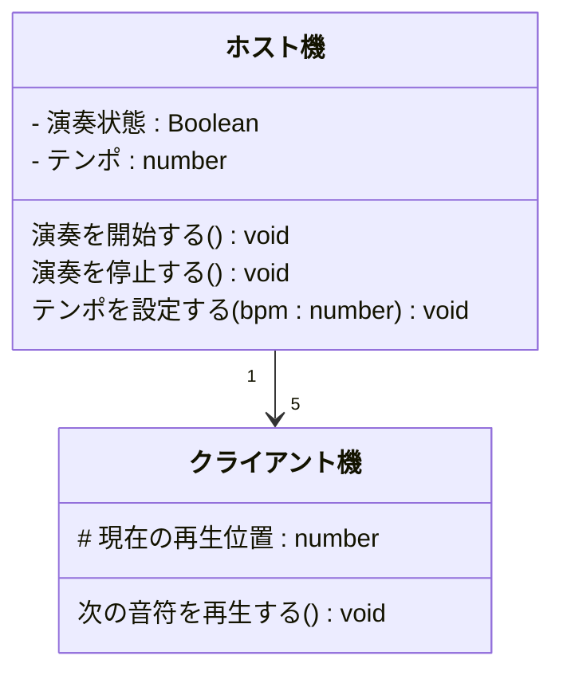

## AI概要

### クラス構成
- **ホスト機**
  - 属性: 演奏状態, テンポ
  - 操作: 演奏を開始する, 演奏を停止する, テンポを設定する
- **クライアント機**
  - 属性: 現在の再生位置
  - 操作: 次の音符を再生する

### 関係
- ホスト機 1 台に対して複数のクライアント機が接続される。
- ホスト機が全体のテンポと開始停止を統括する。

### Mermaid

